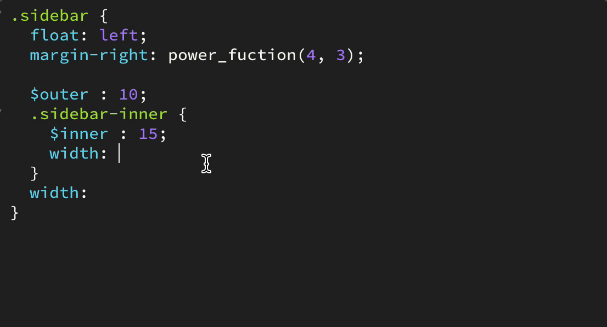

# Intelligent SCSS code hints in Brackets

A [Brackets](http://brackets.io) extension that parses and analyzes all the scss files in the current project to provide contextual code hints for scss files. Hints include scss builts (function, at-rules, mixins), classes, mixins, function and variables (normal, nested and arguments).

Uses the independent [scss-analyzer](https://github.com/shubhsnov/scss-analyzer), which itself is based on a custom [fault tolerant fork](https://github.com/shubhsnov/gonzales-pe) of [gonzales-pe](https://github.com/tonyganch/gonzales-pe)

Feature requests should go in Issues.

And all help will be appreciated to expand and improve this extension.
Thanks.

## Hinting Support

### SCSS Builtin Hints for at-rules, function and mixins

### Hints from imported files

### Contextual hints for variables which respect nesting

### Normal variable hints

### Function hints with signature

### Mixin hints with signature

### Class hints

